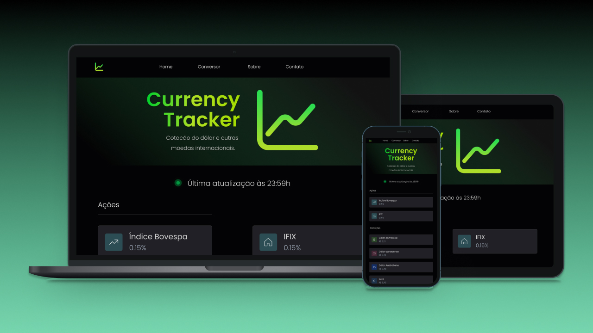

  

## 🚀 Tecnologias

Esse projeto foi desenvolvido com as seguintes tecnologias:

- HTML
- CSS
- JavaScript

## 🚧 Projeto - Em construção:

Dashboard para acompanhar a cotação do dólar e outras moedas internacionais e virtuais.

## 🎨 Design:

Figma: https://www.figma.com/community/file/1210742931957448073

---

Feito com ♥ by birobirobiro
